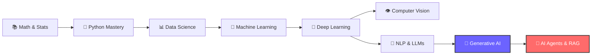

<div align="center">

# Hey there! 👋 I'm **Muhammad Faheem**

### 🤖 AI Engineer | Machine Learning & Generative AI | Building Intelligent Systems

[](https://github.com/Muhammadfaheem8988)
[](https://github.com/Muhammadfaheem8988?tab=followers)


</div>

---

## 🧠 About Me

```python
class MuhammadFaheem:
    def __init__(self):
        self.role = "AI Engineer"
        self.location = "🌍 Pakistan"
        self.current_focus = "Generative AI, LLMs & Intelligent Agents"
        self.passion = "Turning raw data into smart solutions"

    def daily_routine(self):
        return ["☕ Coffee", "📊 Data", "🧠 Model", "🚀 Deploy", "🔁 Repeat"]
```

- 🔬 Currently exploring **LLMs, RAG Pipelines & AI Agents**
- 🧪 Passionate about **Machine Learning, Deep Learning & Computer Vision**
- 🏗️ Building **end-to-end AI solutions** — from data to deployment
- 💬 Ask me about **Python, TensorFlow, PyTorch, LangChain, Hugging Face**
- ⚡ Fun fact: I train models and they train my patience 😄

---

## 🛠️ Tech Stack

<div align="center">

### 🤖 AI / ML / DL


### 🧬 Generative AI & NLP


### 📊 Data & Visualization


### ⚙️ Backend & Deployment


### 🧰 Tools & Platforms


</div>

---

## 📊 GitHub Stats

<div align="center">


<br/>


</div>

---

## 🏆 GitHub Trophies

<div align="center">


</div>

---

## 🧭 My AI Journey Roadmap



---

## 🤝 Let's Connect

<div align="center">

[](https://github.com/Muhammadfaheem8988)
[](https://linkedin.com/in/)
[](https://kaggle.com/)
[](mailto:your-email@example.com)

</div>

---

<div align="center">

### 🧠 *"AI is not about replacing humans — it's about amplifying human potential."*


</div>
